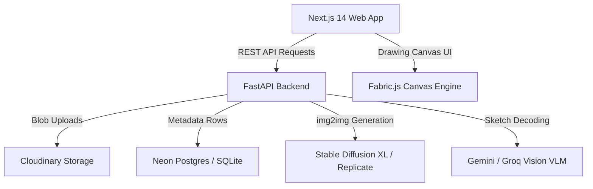

# Smart AI Painter Studio

> **Sketch first. Let AI bring it to life.**
> A premium, workspace-first sketch editor that translates rough drawings into polished AI artwork in real time without ever leaving the canvas.


---

## Core Features

- 🎨 **Full Fabric.js Workspace** — Interactive canvas, active tool badges, page size presets (Square, Portrait, Landscape), zoom controls, and undo/redo history.
- 🖌️ **Advanced Toolset** — Draw, erase, select, rotate, resize, delete, and pan elements. Custom brush thickness controller and dynamic quick-color swatches with a hex picker.
- ⚡ **AI Generation Studio** — Describe your drawing hint, select style presets, adjust generation strength, and generate high-fidelity artwork.
- 🤖 **VLM Image Interpretation** — Integrates Vision Language Models (Gemini / Groq Vision) to output detected main objects, confidence levels, and short interpretations.
- 📱 **Responsive Workspace Shells** — Three dedicated viewports with touch-first controls for Mobile Phone, Tablet, and Desktop monitor screens.
- 🔄 **Perfect Slider sweeps & Split Views** — Side-by-side comparison split view and alignment-balanced before/after slider comparison mode.
- 🗄️ **Public Gallery Hub** — Local gallery search, date sorting, and canvas size filters to browse all drawing sketches and generated variations.
- 🌓 **Ambient Dark / Light modes** — Custom premium themes responding automatically to system settings.

---

## Architecture

The project is structured as a decoupled Next.js 14 frontend and a FastAPI backend. It utilizes Neon PostgreSQL/SQLite metadata tables, Cloudinary image storage, and local or hosted Stable Diffusion image generators.



### Core Flow
1. User draws on the Fabric.js canvas
2. Canvas is exported as base64 PNG
3. `POST /api/v1/generate` sends the sketch, description hint, and style preset to the backend
4. Backend runs a Vision Language Model (VLM) to analyze and tag the sketch features (confidence, objects, description)
5. Backend forwards the sketch to the active image generator provider (Stable Diffusion XL / Replicate)
6. Generated image is uploaded to Cloudinary, metadata is saved to the database, and the base64 output is returned to the user

---

## Tech Stack

| Layer | Technologies |
|---|---|
| **Frontend** | Next.js 14 (App Router), TypeScript, Fabric.js, Tailwind CSS (Vanilla CSS variables), TanStack Query v5, Zustand state store |
| **Backend** | Python 3.13, FastAPI, Uvicorn, Pillow (PIL), Pydantic v2, asyncpg, SQLite / PostgreSQL |
| **Integrations** | Cloudinary API (Assets Storage), Replicate / Diffusers API (SDXL), Gemini / Groq API (VLM Analysis) |
| **CI/CD** | GitHub Actions (CI Typecheck & Lints) |

---

## Repository Layout

```
smart-ai-painter/
├── .github/workflows/  # CI pipelines
├── assets/             # Project screenshots & media assets
├── backend/            # Python FastAPI service & database models
└── frontend/           # Next.js 14 TypeScript app & components
```

---

## Getting Started

### 1. Prerequisites
Ensure you have the following installed on your machine:
- Node.js 20+
- Python 3.12+ / 3.13+

### 2. Backend Setup
1. Open the backend folder:
   ```bash
   cd backend
   ```
2. Create and activate a virtual environment:
   ```bash
   python -m venv .venv
   source .venv/bin/activate
   ```
3. Install dependencies:
   ```bash
   pip install -r requirements.txt
   ```
4. Copy the environment variables template and fill in your keys (Gemini/Groq, Cloudinary, etc.):
   ```bash
   cp .env.example .env
   ```
5. Run the development server:
   ```bash
   python -m uvicorn app.main:app --reload
   ```
   Runs on [http://localhost:8000](http://localhost:8000).

### 3. Frontend Setup
1. Open the frontend folder:
   ```bash
   cd frontend
   ```
2. Install dependencies:
   ```bash
   npm install
   ```
3. Run the development server:
   ```bash
   npm run dev
   ```
   Runs on [http://localhost:3000](http://localhost:3000).

---

## Keyboard Shortcuts

| Shortcut | Action |
|---|---|
| `Ctrl/⌘ + Z` | Undo |
| `Ctrl/⌘ + Shift + Z` | Redo |
| `Ctrl/⌘ + Y` | Redo (Alternate) |
| `Delete / Backspace` | Delete selected elements |
| `V` | Select / Move Tool |
| `H` | Hand / Pan Tool |
| `B` | Brush Tool |
| `E` | Eraser Tool |
| `R` | Rectangle Shape Tool |
| `O` | Ellipse Shape Tool |
| `L` | Line Shape Tool |

---

## License
MIT
