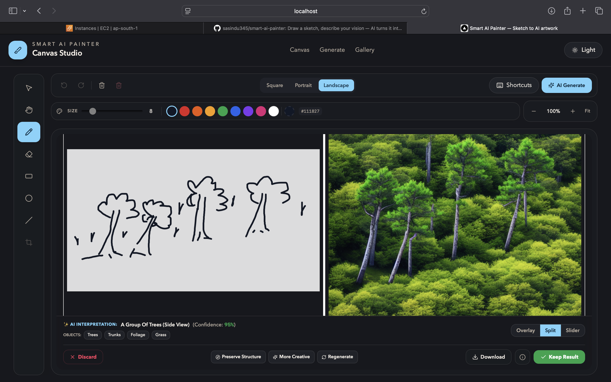
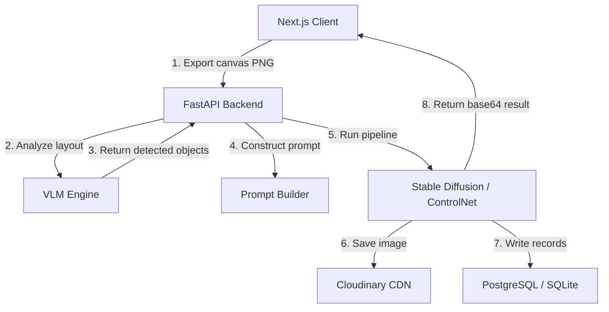

# Smart AI Painter Studio

> **Sketch first. Let AI bring it to life.**

Smart AI Painter is a workspace-first, interactive drawing application that translates hand-drawn sketches into high-fidelity AI artwork in real time. Built as a decoupled Next.js web application and a FastAPI python engine, the system utilizes Vision Language Models (VLMs) to decode visual semantics and Stable Diffusion ControlNet pipelines to preserve the precise structure and coordinates of hand-drawn sketches.



---

## Why Smart AI Painter?

### The Problem with Traditional Sketch-to-Image Tools
Most modern AI image generators require the user to write descriptive text prompts to define the scene. If an artist draws a house but prompts "a futuristic castle", the AI is caught in a conflict between text guidance and spatial drawing, leading to poor alignment. Furthermore, forcing the user to type text prompts breaks the flow of drawing.

### The Power of Prompt-Free Generation
Smart AI Painter solves this by making the drawing brush the primary input. Instead of typing what they want, the user draws it. The application automatically decodes the sketch's content, geometry, and structure to generate matching high-fidelity artwork.

### VLM & ControlNet Collaboration
The system splits the pipeline into two parallel channels:
1. **Semantic Channel (VLM)**: A Vision Language Model (such as Gemini or Groq LLaVA) looks at the drawing, identifies the main subject, detects auxiliary objects, assigns a confidence level, and constructs a descriptive prompt description.
2. **Spatial Channel (ControlNet)**: A Stable Diffusion ControlNet pipeline parses the sketch outlines, ensuring that the final output preserves the precise positioning, lines, and spatial layout of the hand-drawn elements.

### More than an API Wrapper
Unlike simple wrappers that forward text prompts directly to OpenAI or Midjourney, this project implements a complete custom software engineering pipeline. It features image preprocessing, provider abstraction boundaries, deterministic prompt builders, database transactions, and a stateful responsive canvas workspace.

---

## Core Features

- 🧠 **Prompt-Free AI Generation** — Generate high-fidelity images directly from sketches without requiring manually typed prompt descriptions.
- 👁️ **Vision Language Model Scene Understanding** — Real-time AI analysis that detects objects, evaluates confidence, and constructs descriptive prompt templates.
- 📐 **Structure-Preserving Image Generation** — Guides Stable Diffusion using ControlNet edge detection to match drawing strokes and positioning.
- ✏️ **Interactive Canvas Workspace** — Freehand drawing, shapes (lines, circles, rectangles), zooming, panning, undo/redo stack, and brush customization.
- ↕️ **Before/After Comparison Slider** — Sweep comparison slider and side-by-side split panels to compare original sketches with AI variations.
- 📱 **Responsive Desktop, Tablet, and Mobile Interface** — Responsive, touch-first layouts tailored for monitors, tablets, and phones.
- 🗃️ **Gallery Management** — Public hub to browse, search, filter by canvas size, sort by date, and download generated artworks.

---

## Architecture & Workflow

### Technical System Design
The system decouples the Next.js frontend workspace from a FastAPI backend server. Below is the technical flow of data through the system:



### Visual Image Pipeline
```
  [ Hand Sketch ]
         │
         ▼
  [ Image Preprocessing ] ──▶ Normalizes aspect ratios & resolution bounds
         │
         ▼
  [ Vision Language Model (VLM) ] ──▶ Decodes sketch composition & object semantic nodes
         │
         ▼
  [ Structured Scene Analysis ] ──▶ Extracts detected objects & confidence metadata
         │
         ▼
  [ Dynamic Prompt Builder ] ──▶ Compiles metadata into deterministic prompt structures
         │
         ▼
  [ ControlNet Edge Pipeline ] ──▶ Locks coordinate paths & spatial geometries
         │
         ▼
  [ Stable Diffusion Engine ] ──▶ Synthesizes textures, lighting, and detail structures
         │
         ▼
  [ Cloudinary + DB Storage ] ──▶ Registers file CDN assets and database rows
```

---

## Technical Highlights & Engineering Decisions

### 1. Hybrid Remote GPU Execution (Colab + ngrok Tunneling)
* **The Problem**: Running large-scale deep learning models like Stable Diffusion XL and ControlNet locally is highly resource-intensive. On standard developer laptops lacking dedicated CUDA-enabled GPUs with high VRAM, running local generation pipelines either causes Out-Of-Memory (OOM) crashes or takes minutes per image.
* **The Solution**: Designed a hybrid runtime architecture. The core FastAPI app runs on the local server, while the heavy Stable Diffusion ControlNet pipeline runs on a remote high-performance GPU server (e.g. a free Google Colab T4/A100 GPU instance). We set up a secure TCP/HTTP reverse proxy tunnel using **ngrok** to link the remote GPU server to our backend. This allows the backend to dispatch generation payloads and retrieve high-fidelity base64 outputs with low latency.
* **Future Improvements**: Transition from single-instance Colab tunnels to containerized serverless compute engines (e.g., RunPod, Modal, or Replicate serverless endpoints) featuring cold-start optimizations to support seamless horizontal scale-out.

### 2. Extensible Provider Abstraction & Registry
The AI generation and vision engines are designed using strict abstract base classes (`GenerationProvider` and `VisionProvider`). Switching between Gemini Vision, Groq LLaVA, local Diffusers servers, or Replicate is controlled via environment variables in the central config registry.

### 3. Offline-First Development Mode
Includes dedicated `MockGenerationProvider` and `MockVisionProvider` implementations. This enables offline developer testing and UI integration validation without consuming third-party API tokens or requiring an active GPU tunnel connection.

---

## Tech Stack & Rationale

### Frontend
* **Next.js 14 (App Router)** — Selected for fast hydration, modular file-based routing, and optimal asset bundling.
* **TypeScript** — Enforces compile-time type-safety for properties, canvas models, and API payloads.
* **Fabric.js Canvas Engine** — Delivers a high-performance vector canvas API with object scaling, rotation, undo/redo serialization, and brush controls.
* **Zustand** — A lightweight, friction-free state store to coordinate canvas settings, tools, colors, and AI loading states.
* **TanStack Query v5** — Manages caching, background fetching, and mutation lifecycles for public gallery resources.

### Backend
* **FastAPI** — An asynchronous, high-performance python framework capable of handling concurrent network requests efficiently.
* **Uvicorn** — A lightning-fast ASGI server implementation for asynchronous execution.
* **Pydantic v2** — Used for strict input validation, parsing, and type-coercion of incoming frontend requests.
* **SQLite / PostgreSQL (asyncpg)** — High-performance database adapters to register local metadata schema rows without blocking the event loop.

---

## Project Workflow

```
   ┌───────────────┐
   │  Draw Sketch  │  <── User draws on Fabric.js canvas
   └───────┬───────┘
           │
           ▼
   ┌───────────────┐
   │ AI VLM Decod  │  <── Vision model extracts objects & confidence
   └───────┬───────┘
           │
           ▼
   ┌───────────────┐
   │ Prompt Build  │  <── Constructs stable diffusion guidance prompt
   └───────┬───────┘
           │
           ▼
   ┌───────────────┐
   │ AI Generation │  <── ControlNet locks drawing geometry for img2img
   └───────┬───────┘
           │
           ▼
   ┌───────────────┐
   │ Slider/Split  │  <── User compares sketch & AI artwork side-by-side
   └───────┬───────┘
           │
           ▼
   ┌───────────────┐
   │ Download/Save │  <── CDN asset generated and recorded to database
   └─────────┘
```

---

## Project Highlights (For Recruiters)

- ⚡ **Multi-Agent AI Orchestration** — Built a pipeline that combines Vision Language Models (VLMs) for semantic understanding and ControlNet (SDXL) for structural geometry preservation.
- 📐 **Strict Object-Oriented Abstraction** — Designed modular provider architectures allowing AI providers, database adapters, and vision engines to be swapped via environment variables.
- 🚀 **Frictionless Local Execution** — Configured automatic fallback authorization to support local sandbox execution with zero setup overhead.
- 📱 **Sophisticated Responsive Shells** — Developed custom layout engines for mobile, tablet, and desktop viewports, complete with custom gesture boundaries.
- 🧪 **Offline-First Development** — Created mock VLM and image generation providers to enable comprehensive end-to-end integration testing and offline development.
- 🔒 **Database and CDN Integration** — Integrated async database adapters (asyncpg) and Cloudinary media upload pipelines.

---

## Roadmap

- [x] **Interactive Canvas** — Drawing tools, shape builders, sizing, and panning.
- [x] **VLM Scene Analysis** — Semantic object detection and confidence evaluation.
- [x] **AI Generation Studio** — Style presets and ControlNet structure locking.
- [x] **Comparison Viewports** — Side-by-side split panels and sweep sliders.
- [x] **Responsive Interfaces** — Custom mobile, tablet, and desktop layouts.
- [ ] **Local GPU Provider** — Standardized local runner package for home workstations.
- [ ] **Fine-Tuned ControlNet** — Tailored control models for exact stroke fidelity.
- [ ] **Multi-Image Variations** — Generate multiple style alternatives simultaneously.
- [ ] **Batch Processing** — Pipeline queue for queuing multiple generation jobs.
- [ ] **Real-time Collaboration** — Live shared drawing sessions via WebSockets.

---

## Getting Started

### 1. Prerequisites
Ensure you have the following installed on your machine:
- Node.js 20+
- Python 3.12+ / 3.13+

### 2. Backend Setup
1. Open the backend folder:
   ```bash
   cd backend
   ```
2. Create and activate a virtual environment:
   ```bash
   python -m venv .venv
   source .venv/bin/activate
   ```
3. Install dependencies:
   ```bash
   pip install -r requirements.txt
   ```
4. Copy the environment variables template and fill in your keys (Gemini/Groq, Cloudinary, etc.):
   ```bash
   cp .env.example .env
   ```
5. Run the development server:
   ```bash
   python -m uvicorn app.main:app --reload
   ```
   Runs on [http://localhost:8000](http://localhost:8000).

### 3. Frontend Setup
1. Open the frontend folder:
   ```bash
   cd frontend
   ```
2. Install dependencies:
   ```bash
   npm install
   ```
3. Run the development server:
   ```bash
   npm run dev
   ```
   Runs on [http://localhost:3000](http://localhost:3000).

---

## Keyboard Shortcuts

| Shortcut | Action |
|---|---|
| `Ctrl/⌘ + Z` | Undo |
| `Ctrl/⌘ + Shift + Z` | Redo |
| `Ctrl/⌘ + Y` | Redo (Alternate) |
| `Delete / Backspace` | Delete selected elements |
| `V` | Select / Move Tool |
| `H` | Hand / Pan Tool |
| `B` | Brush Tool |
| `E` | Eraser Tool |
| `R` | Rectangle Shape Tool |
| `O` | Ellipse Shape Tool |
| `L` | Line Shape Tool |

---

## License
MIT
